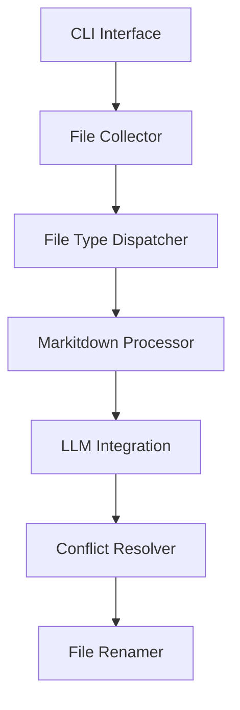
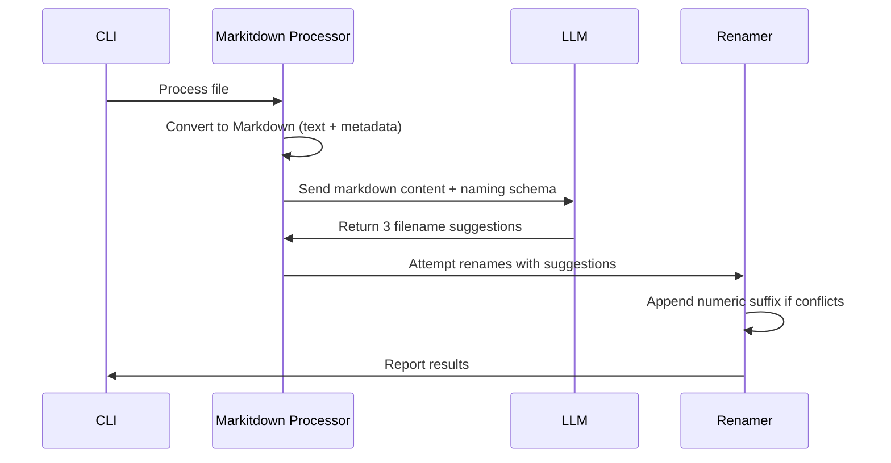

# Onoma Command Line Tool Architecture Plan

## 1. Revised Core Architecture


## 2. Simplified Processing Pipeline


## 3. LLM Integration
- **OpenAI/API Compatible**
  - Use `openai` Python package
  - Configurable endpoint for local LLMs
- **Google Generative AI**
  - Use `google-generativeai` package
- **Structured Output**
  - JSON schema for filename suggestions in snake_case:
```json
{
  "$schema": "http://json-schema.org/draft-07/schema#",
  "title": "Snake Case File Name Suggestions",
  "type": "object",
  "properties": {
    "suggestions": {
      "type": "array",
      "minItems": 3,
      "maxItems": 3,
      "items": {
        "type": "string",
        "pattern": "^[a-z0-9]+(_[a-z0-9]+){0,14}$",
        "maxLength": 128
      }
    }
  },
  "required": ["suggestions"],
  "additionalProperties": false
}
```

  - JSON schema for filename suggestions in camelCase:
```json
{
  "$schema": "http://json-schema.org/draft-07/schema#",
  "title": "CamelCase File Name Suggestions",
  "type": "object",
  "properties": {
    "suggestions": {
      "type": "array",
      "minItems": 3,
      "maxItems": 3,
      "items": {
        "type": "string",
        "pattern": "^[a-z]+(?:[A-Z][a-z0-9]*){0,14}$",
        "maxLength": 128
      }
    }
  },
  "required": ["suggestions"],
  "additionalProperties": false
}

```

  - JSON schema for filename suggestions in kebab-case:
```json
{
  "$schema": "http://json-schema.org/draft-07/schema#",
  "title": "Kebab Case File Name Suggestions",
  "type": "object",
  "properties": {
    "suggestions": {
      "type": "array",
      "minItems": 3,
      "maxItems": 3,
      "items": {
        "type": "string",
        "pattern": "^[a-z0-9]+(-[a-z0-9]+)*$",
        "maxLength": 128
      }
    }
  },
  "required": ["suggestions"],
  "additionalProperties": false
}

```

  - JSON schema for filename suggestions in PascalCase:
```json
{
  "$schema": "http://json-schema.org/draft-07/schema#",
  "title": "Pascal Case File Name Suggestions",
  "type": "object",
  "properties": {
    "suggestions": {
      "type": "array",
      "minItems": 3,
      "maxItems": 3,
      "items": {
        "type": "string",
        "pattern": "^[A-Z][a-z0-9]*(?:[A-Z][a-z0-9]*)*$",
        "maxLength": 128
      }
    }
  },
  "required": ["suggestions"],
  "additionalProperties": false
}

```

  - JSON schema for filename suggestions in dot.notation:
```json
{
  "$schema": "http://json-schema.org/draft-07/schema#",
  "title": "Dot Notation File Name Suggestions",
  "type": "object",
  "properties": {
    "suggestions": {
      "type": "array",
      "minItems": 3,
      "maxItems": 3,
      "items": {
        "type": "string",
        "pattern": "^[a-z0-9]+(\\.[a-z0-9]+)*$",
        "maxLength": 128
      }
    }
  },
  "required": ["suggestions"],
  "additionalProperties": false
}

```

  - JSON schema for filename suggestions in natural language / space-separated:
```json
{
  "$schema": "http://json-schema.org/draft-07/schema#",
  "title": "Natural Language File Name Suggestions",
  "type": "object",
  "properties": {
    "suggestions": {
      "type": "array",
      "minItems": 3,
      "maxItems": 3,
      "items": {
        "type": "string",
        "pattern": "^[A-Za-z0-9]+( [A-Za-z0-9]+)*$",
        "maxLength": 128
      }
    }
  },
  "required": ["suggestions"],
  "additionalProperties": false
}
```

## 4. Conflict Resolution Algorithm
```
1. Receive 3 suggestions from LLM (S1, S2, S3)
2. For each suggestion in order:
   a. Check if filename exists in target directory
   b. If available, use this filename
   c. If conflict, try next suggestion
3. If all suggestions conflict:
   a. Take first suggestion (S1)
   b. Append "_1"
   c. If conflict, increment number until available
```

## 5. Configuration System (Updated)
- **Config File**: `~/.onomarc` (TOML format)
- **Options**:
  ```toml
  default_provider = "openai"  # or "google"
  openai_api_key = ""
  openai_base_url = "https://api.openai.com/v1"
  google_api_key = ""
  naming_convention = "snake_case"  # or "CamelCase", etc.

  [markitdown]
  enable_plugins = false
  docintel_endpoint = ""   # For Azure Document Intelligence
  llm_model = "gpt-4o"     # For image descriptions
  ```

## 6. Revised Implementation Roadmap

### Phase 1: Core Markitdown Integration
1. Add Markitdown dependency (`pip install markitdown`)
2. Implement `MarkitdownProcessor` class
3. Update file dispatcher to use Markitdown for supported formats
4. Maintain text processor for .txt/.md files
5. Update configuration system

### Phase 2: Advanced Processing
2. Add LLM-powered image description support

### Phase 3: Optimization & Polish
1. Batch processing for large file sets
2. Custom metadata extraction hooks
3. Enhanced error handling
4. Comprehensive documentation

---
